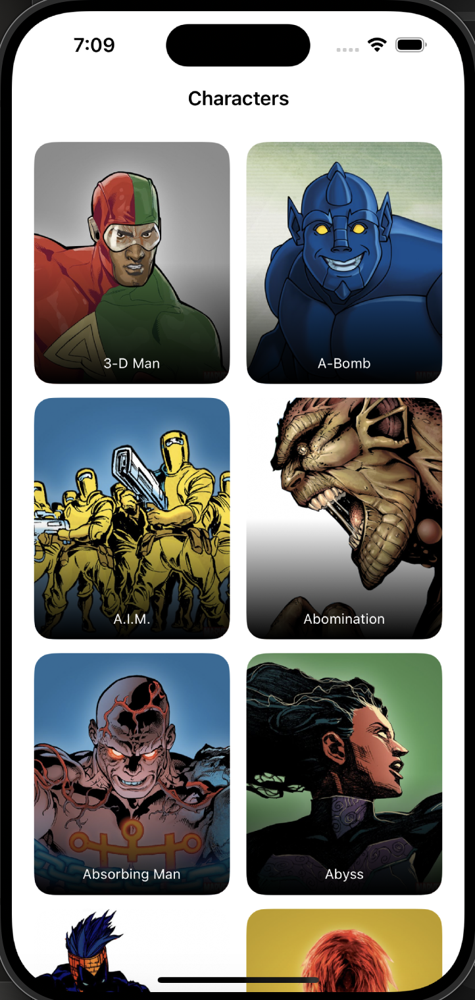
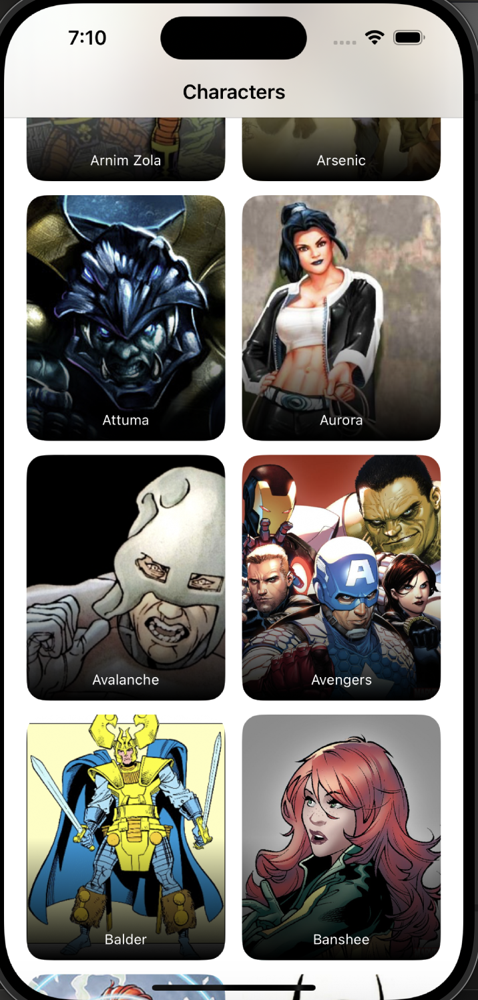
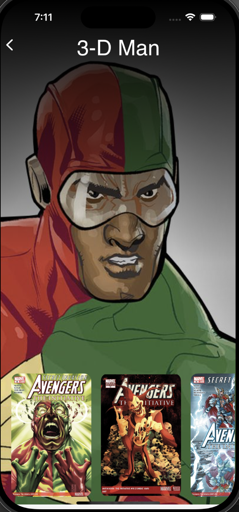
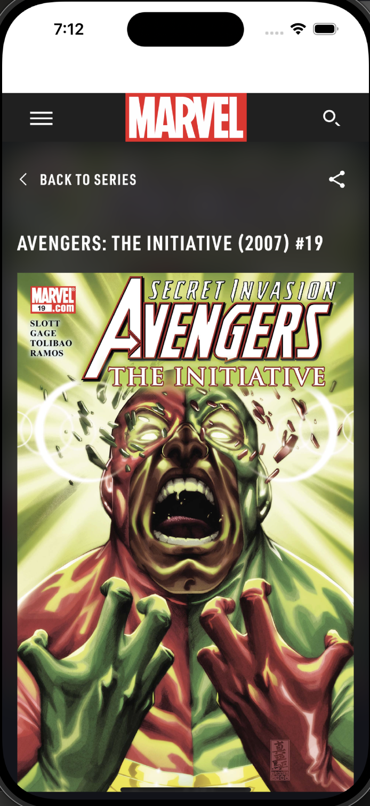

# MarvelDemo

MarvelDemo is a project showcasing Marvel characters with their images and their names using the Marvel API. When you click on any character, you can view their list of comics in a carousel form. Feel free to swipe to see the previous or the next character of your preference. Last but not least, clicking on a comic that interests you directs you to its detailed web page.

## Screenshots
<p float="left">
  
  
  
  
</p>

## Setup Instructions

1. **Get Marvel API Keys:**
   - Go to [Marvel Developer Portal](https://developer.marvel.com/) and create an account.
   - Obtain your public and private keys.

2. **Configuration:**
   - Create a `Config.xcconfig` file in the root directory of the project.
   - Add your Marvel API keys to the `Config.xcconfig` file:
     ```plaintext
     API_PUBLIC_KEY = your_public_key
     API_PRIVATE_KEY = your_private_key
     ```

3. **Add Configurations to Xcode:**
   - Open your project in Xcode.
   - Select your project in the Project Navigator.
   - Go to the "Info" tab and add your `Config.xcconfig` file to both Debug and Release configurations.

4. **Update `Info.plist`:**
   - Ensure your `Info.plist` includes placeholders for the API keys:
     ```xml
     <key>API_PUBLIC_KEY</key>
     <string>$(API_PUBLIC_KEY)</string>
     <key>API_PRIVATE_KEY</key>
     <string>$(API_PRIVATE_KEY)</string>
     ```

5. **Set Correct Path to `Info.plist`:**
   - In Xcode, select the project in the Project Navigator.
   - Select the **MarvelDemo** target.
   - Go to the **Build Settings** tab.
   - Search for **Info.plist File** under the **Packaging** section.
   - Ensure the path is set to `MarvelDemo/Info.plist`.

6. **Open in Xcode:**
   - Open the project in Xcode.

7. **Run the Project:**
   - Build and run the project.

## Project Structure

- **MarvelDemoApp:** Entry point of the application.
- **ContentView:** Displays the list of Marvel characters. Scroll down to load more characters.
- **DetailView:** Displays the details of a selected character and their comics. Swipe to see the next or previous character.
- **ComicDetailView:** Displays the detailed view of a comic using a WebView.
- **MarvelAPI:** Handles API requests to fetch characters and comics.
- **WebView:** Wraps WKWebView for displaying web content.
- **MarvelModel:** Data models for characters and comics.
- **Environment:** Holds static API keys retrieved from the Config.xcconfig file.

## Folder Structure

- 📁 MarvelDemo/
  - 📁 MarvelDemo/
    - 📁 Assets.xcassets/
    - 📁 Preview Content/
      - 📁 Preview Assets/
    - 📄 ContentView.swift
    - 📄 DetailView.swift
    - 📄 ComicDetailView.swift
    - 📄 MarvelAPI.swift
    - 📄 WebView.swift
    - 📄 MarvelModel.swift
    - 📄 Environment.swift
    - 📄 Info.plist
    - 📄 Config.xcconfig (to be created by the user)
  - 📁 screenshots/
    - 📄 screenshot1.png
    - 📄 screenshot2.png
    - 📄 screenshot3.png
    - 📄 screenshot4.png
  - 📄 MarvelDemo.xcodeproj
  - 📄 README.md

## Development Environment

- **Xcode:** Version 12.0+
- **Swift:** Version 5.0+
- **iOS:** Version 14.0+

## License

This project is licensed under the MIT License. See the [LICENSE](LICENSE) file for details.


